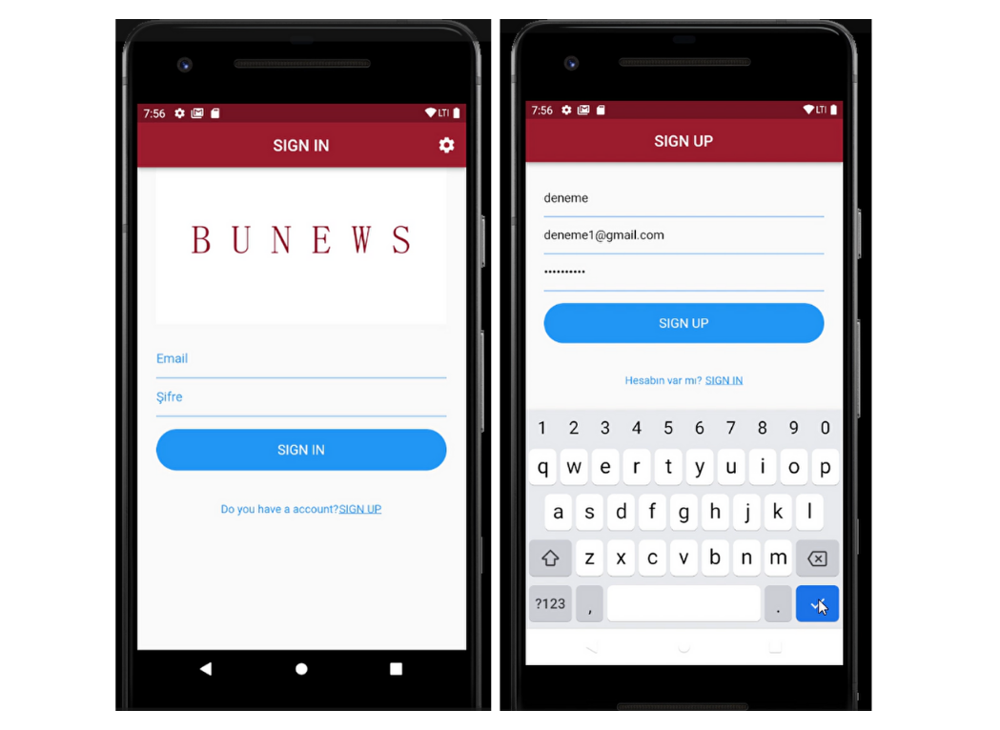

# BUNEWS - Haber Uygulaması

BUNEWS, haberleri takip etmek için kullanıcı dostu bir mobil uygulamadır. Güncel haberlere erişmek, favori haberleri saklamak ve düşüncelerinizi paylaşmak için mükemmel bir platformdur. Ayrıca dil seçenekleri ve tema modları ile uygulamayı kişiselleştirebilirsiniz.

## 🚀 Özellikler

- **Güncel Haberler:** NEWS API entegrasyonu sayesinde sürekli güncel haberlere erişim sağlanmaktadır.
- **Favoriler:** Beğendiğiniz haberleri favorilere ekleyebilir ve daha sonra kolayca erişebilirsiniz.
- **Yorum Yapma:** Haberler hakkında düşüncelerinizi paylaşabilirsiniz.
- **Dil ve Tema Seçenekleri:** İngilizce veya Türkçe dil seçeneği ve light/dark tema modu bulunmaktadır.
- **Gestures Desteği:** Uygulama içinde çeşitli gestures kullanılmıştır.
- **Dosya İşlemleri:** Klasör ve dosya yapıları düzenli bir şekilde oluşturulmuştur.
- **Varlıklar ve Resimler:** Uygulamada kullanılan fotoğraflar ve dil seçenekleri için json dosyaları mevcuttur.
- **Grafik Kullanımı:** Grafikler kullanılarak veriler görselleştirilmiştir.
- **API Entegrasyonu:** NEWS API üzerinden veri okuma ve yazma işlemleri yapılmıştır.
- **Yerel Veritabanı:** SharedPreferences kullanılarak yerel veritabanı işlemleri gerçekleştirilmiştir.
- **Firebase Entegrasyonu:** Firebase ve Firestore kullanılarak kullanıcı oturumu durumu, kullanıcı adı ve kullanıcı e-posta adresi gibi bilgilerin saklanması ve erişilmesi sağlanmıştır. Ayrıca favorilerin veritabanına eklenmesi, belirli bir e-postaya sahip favori öğelerinin getirilmesi, bir yorumun veritabanına eklenmesi ve belirli bir e-postaya sahip yorumların getirilmesi gibi işlemler yapılmıştır.
- **Widgetlar:** Uygulamada birçok farklı widget kullanılmıştır, hatta özel widgetlar oluşturulmuştur.
- **Animasyonlar:** Animasyonlar kullanılarak kullanıcı deneyimi artırılmıştır.
- **Ekran Tasarımları:** Giriş, kayıt ve diğer ekranlar tasarlanmış ve Firebase ile entegre edilmiştir.

